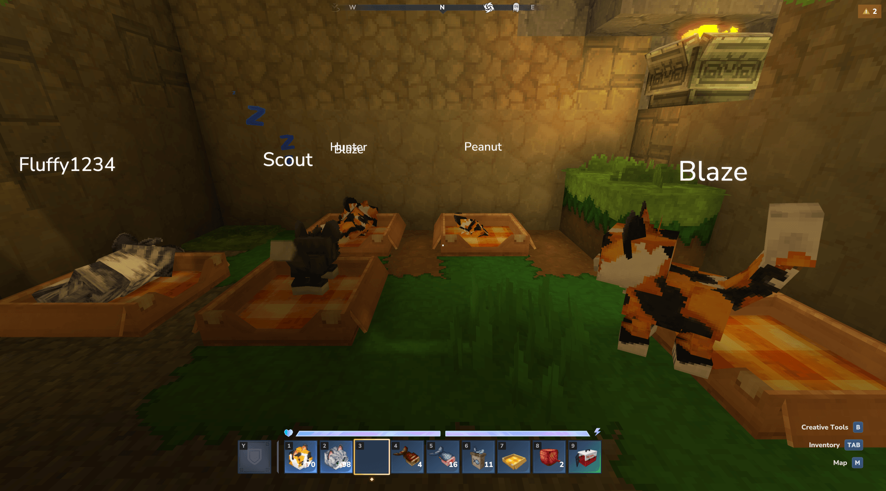
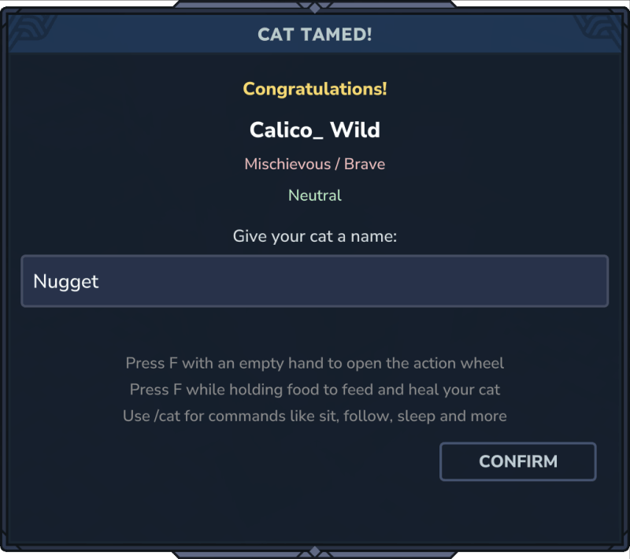
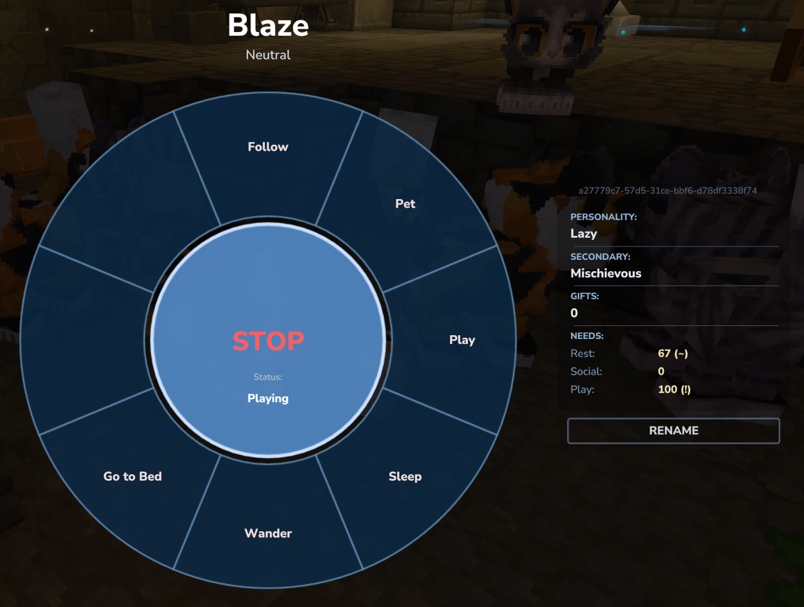
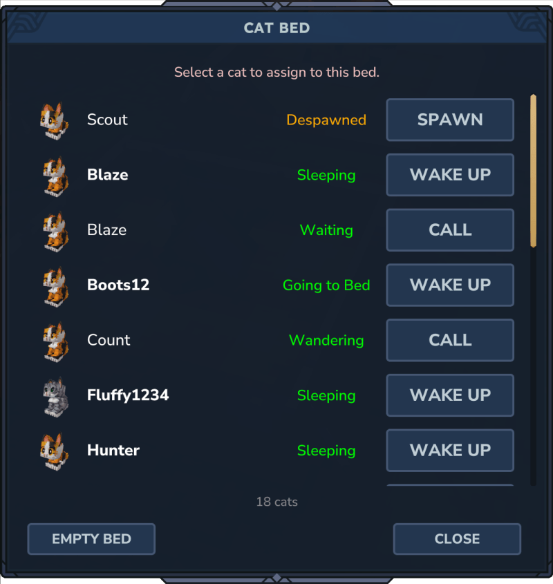

# 🐱 Cats - Tameable Cat Companions for Hytale

⚠️ **BETA VERSION** This is a beta version and several features are still being polished.

> **Important update note:**
> Always remove all old versions of this plugin from your mods folder before updating, to avoid
> issues like double saving or server startup errors.

## 📖 Overview

Cats adds tameable cat companions to Hytale with natural world spawning, trust-based taming,
personality-driven moods, and cozy home features like beds, carriers, toys, and treats.

The mod is built first and foremost for players who want lively companions in their world, while
still offering enough systems and polish to stand out as a Hytale New Worlds Contest project.

You can explore for wild cats, slowly earn their trust with fish, give them a name, open the
Action Wheel with `F`, and build a little home routine around play, sleep, and companionship.

## 🎥 Introduction and Overview Video

<iframe width="788" height="443" src="https://www.youtube.com/embed/I6DkmDzukmU" frameborder="0" allowfullscreen="allowfullscreen"></iframe>

## 🚀 Quick Start

If you just want to jump in and start playing with cats, this is the fastest path:

1. Explore the world and look for wild cats in the natural spawn zones.
2. Bring fish, approach carefully, and feed a wild cat multiple times to gain its trust.
3. Once tamed, use `F` with an empty hand to pet your cat and open the Action Wheel.
4. Craft a Cat Bed, Cat Carrier, Cat Yarn Ball, and Cat Treats to care for your companion.
5. Use commands like `/cat bed`, `/cat follow`, or `/cat sleep` as optional advanced control when
   you want more direct behavior management.

### Early Player Tips

* Fish can tame, heal, and cheer up your cat.
* Better fish improves your taming chance per feeding.
* Each cat belongs to one player only once tamed.
* In Creative Mode, enable `Allow NPC Detection` in the quick settings to interact more reliably.

The taming flow also ends with a custom screen that shows mood, personality, and lets you set a
real name for your new companion right away.

## ✨ Why It Stands Out

* Cats spawn naturally across multiple zones instead of feeling like menu-only companions.
* Taming takes trust over time, which makes the first companion feel earned.
* Personality, mood, gifts, and needs give your cats a little life beyond simple follow behavior.
* The Action Wheel keeps most interactions in-world and easy to learn from the first minute.
* Home items like the Cat Bed and Cat Carrier make cats useful for both adventure and decoration.

The Action Wheel is also where the companion systems come together: you can see live state,
personality, gift count, and the current Rest, Social, and Play needs without leaving the world.

## 🛏️ Cat Bed Showcase

The Cat Bed is more than decoration. It is both a sleeping spot and a management point for your
cats.

When you use a Cat Bed, the mod finds the nearest bed in range and opens the **Cat Bed** screen.
That screen shows your owned cats, their current status, and the actions that make sense for them:
**Spawn**, **Call**, or **Wake Up**. If a cat is already resting there, you can also use
**Empty Bed** to clear sleeping cats near that bed.

This makes the bed useful even when a cat is currently despawned, already in the world, or asleep.
It also pairs naturally with `/cat bed`, which sends a nearby tamed cat to the nearest available
bed.

### Cat Bed Screen

The Cat Bed screen is one of the most useful management tools in the mod, especially once you
start owning multiple cats with different states.

## ✅ Current Features

### Core Companions

* Eight cat variants: Black Cat, Calico, Gray Tabby, Longhaired Russian Blue, Orange Tabby,
  Siamese, Tuxedo, and Kitten (experimental)
* Natural spawning across Zones 1-4 with environment-specific distributions
* Single-owner tamed cats with automatic unique names
* Light social and group behavior when multiple cats are nearby
* Matching sounds, animations, and multiple behavior states

### Taming, Mood, and Personality

* Trust-based taming through repeated fish feeding
* Taming success screen with instant naming plus mood and personality preview
* Personality system that influences how happiness is gained
* Five mood levels from Miserable to Ecstatic with slow decay over time
* Need-driven routine with Rest, Social, and Play affecting autonomous behavior over time
* Happy cats can occasionally bring gifts when petted
* Action Wheel and `/cat info` show personality, gifts, and current needs
* Fish and Cat Treats can heal cats and improve happiness

### Interaction and Daily Use

* Action Wheel UI on `F` with an empty hand, live status, and a companion info panel
* Behaviors such as follow, sit, wait, wander, sleep, play, search, and go to bed
* Rename flow directly in the custom UI
* Cat Carrier for transporting your tamed cats
* Cat Yarn Ball for playful interactions and fetch-style play after throwing it
* Cat Bed UI for bed assignment, calling, spawning, waking up, and status overview

### Persistence and Server Support

* Despawn and respawn flow with `/cat despawn` and `/cat spawn`
* Persistent cat data storage in `worlds/default/resources/CatsData.json`
* Configurable ownership limits through permissions
* Server-side config for general limits, spawn behavior, and damage protection

### Spawning and Testing Options

For normal play, natural spawning is the intended path.

Additional options are available for testing, admin use, or controlled setups:

* Manual spawning with `/npc spawn Cats_<Breed>`
* Spawn eggs such as `Egg_Spawner_Cats_Calico`

## 🧶 Crafting and Care Items

### Cat Carrier

Use the Cat Carrier to pick up and transport your tamed cats.

**Crafting Recipe (Farming Bench):**

* 2x Wood Planks
* 3x Fiber
* 1x White Wool
* 1x Red Wool

Use the carrier on your tamed cat with `F` to pick it up. The icon changes when the carrier is
occupied, so you can see at a glance that a cat is stored inside. Use it again on the ground to
release the cat at a new location.

### Cat Bed

Use the Cat Bed as a cozy resting spot and a direct access point for the **Cat Bed** management
screen.

**Crafting Recipe (Furniture Bench):**

* 4x Wood Planks
* 2x White Wool
* 3x Fiber

Place the bed and interact with it to open the **Cat Bed** screen. You can also use `/cat bed` to
send a nearby tamed cat to the nearest available bed and manage despawned, sleeping, or waiting
cats from one place.

### Cat Yarn Ball

The Cat Yarn Ball is a toy for playful interaction and short fetch sessions with your tamed cats.

**Crafting Recipe (Farming Bench):**

* 2x Fiber

Use it directly on your cat for playful interaction, or throw it so nearby tamed cats can chase it
and bring it back.

### Cat Treats

Cat Treats give a bigger happiness boost than normal fish and can also help with healing.

**Crafting Recipe (Farming Bench):**

* 1x Fish
* 1x Fiber

## ⌨️ Commands

### General Commands

* `/cat reload` - Reload all config files without restarting the server
* `/cat info` - Show detailed cat information
* `/cat list` - List all cats owned by a player
* `/cat owner` - Admin command to change ownership
* `/cat spawn` - Spawn a previously despawned cat
* `/cat despawn` - Despawn a cat and save its state

### Tamed Cat Commands

Commands work by looking at your tamed cat or by providing its entity ID.

* `/cat bed` - Send the cat to the nearest available cat bed
* `/cat follow` - Make the cat follow you
* `/cat name <name>` - Set a custom name
* `/cat play` - Enable playful behavior
* `/cat pounce [target]` - Send a nearby cat to pounce at a target
* `/cat release` - Release your cat back to the wild
* `/cat search` - Send the cat roaming and hunting
* `/cat sit` - Make the cat sit and stay
* `/cat sleep` - Put the cat to sleep
* `/cat wait` - Stop following and wait in place
* `/cat wander` - Allow free roaming

## ⚙️ Configuration

Config files are created in `mods/Cats/` on first startup and can be edited while the server is
running:

* `general.cfg` - Default cat limit per player, default `16`
* `protection.cfg` - Damage filters for owner, other players, mobs, environment, and projectiles
* `spawn.cfg` - Enable or disable natural spawning and adjust the spawn weight multiplier

Apply changes with `/cat reload` without restarting the server.

## 🔐 Permissions

The plugin supports both Hytale's permission system and LuckPerms.

Players can own up to 16 cats by default. Admins can adjust this with permissions such as
`markusbordihn.cats.limit.8` or `markusbordihn.cats.limit.unlimited`.

For detailed permission configuration, see [Permissions Documentation](PERMISSIONS.md).

## 🚧 Planned Features

* Cat breeding and kittens
* Accessories such as collars and bells
* More toys and interactive items
* Additional cat variants
* Cat progression and special abilities

## 🗃️ Data Storage

Cat data is automatically saved to `worlds/default/resources/CatsData.json`, including:

* Cat UUID and owner information
* Cat type, custom name, and current state
* Last known position and spawn status

Back up this file if you want to preserve your cats while moving worlds or testing updates.

## 🐛 Known Issues

* Some animation transitions are not yet smooth
* Pathfinding still needs refinement

## 🔗 Related Plugins

**Dogs Companion**

Looking for loyal combat companions? Check out the Dogs Companion plugin. While Cats focuses on
companionship, home life, and playful interactions, Dogs Companion is designed more around combat
support, guarding, and active adventure play.

[Download Dogs Companion](https://www.curseforge.com/hytale/mods/dogs-companion)

## 🛠️ For Developers

Want to build or modify this plugin? Check out the [Development Guide](DEVELOPMENT.md) for setup
instructions, build tasks, and contribution guidelines.

## 📜 Forks, Variants, and Asset Usage

Forks and variants of this project are welcome.

The source code in this repository is licensed under the MIT License.
The MIT License applies only to the source code and does not apply to non-code assets unless
explicitly stated otherwise.

Non-code assets include, but are not limited to, textures, models, animations, sounds, music,
icons, logos, user interface artwork, promotional images, screenshots, videos, written lore, story
content, and other creative assets.

All rights to these non-code assets are reserved by the author.
The original project name, logo, and branding are also excluded from the MIT License.

If you build your own fork or variant of this project, please use your own name, branding, and
assets unless you have explicit permission to use the original ones.

For the full license text, see [LICENSE.md](LICENSE.md).

---

Enjoy your new feline companions.

*This plugin is under active development. Updates and improvements are added regularly.*
